# WorldEditor

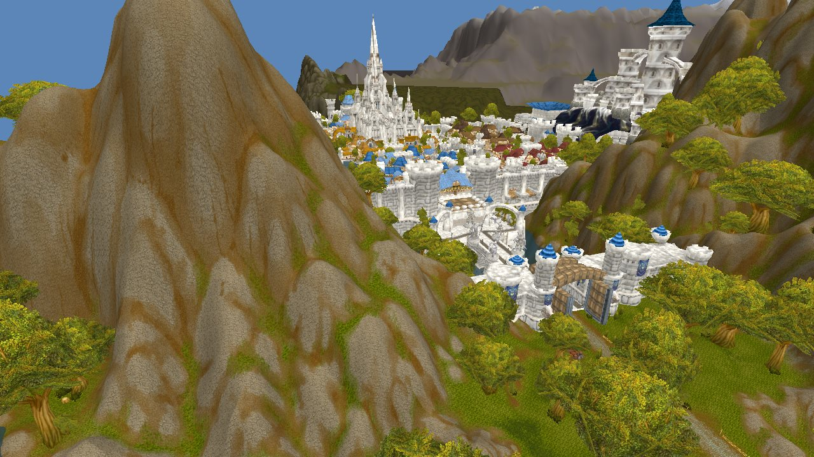

<!-- shot: ui-overview.png - the whole editor window (see docs/images/README.md) -->

A standalone world editor for **World of Warcraft 3.3.5a (build 12340)** and **AzerothCore**. It reads the game's
own files (MPQ archives or unpacked folders), shows the world with its own renderer, and edits terrain, water,
objects, creature and gameobject spawns, paths, zones and world maps. Edits come out as a patch MPQ any 3.3.5 client
can load, plus SQL and DBC files for the server.

It is also built for **merging map versions**: load other versions of a map (other clients, map modules, unpacked
mods) next to yours, compare any area across all of them, and review a whole other version's edits area by area,
approving the ones you want into your map.

## Status

Milestone 1 (the editor core) is done and in use: projects with full undo history, terrain, objects, units, regions,
the AzerothCore link, version merging, and patch building. Everything runs on Windows (Direct3D 11). No license has
been chosen yet.

## Quick start

```
cmake -S . -B build -A x64
cmake --build build --config Release
build\Release\wow-world-editor.exe
```

**File > New project**, pick your 3.3.5 client folder, then pick a map in **Maps** and click a tile.
[Getting started](docs/getting-started.md) covers the build, the window, the tools and the controls.

## Features

### Terrain
| Feature | What it does |
| --- | --- |
| [Sculpt, paint and holes](docs/terrain/sculpt-paint-holes.md) | Raise, lower, flatten (ramps, fill or cut only) and smooth ground with five falloffs; move picked vertices; paint and swap up to four textures per chunk; shade vertex colours; cut and fill holes |
| [Roads](docs/terrain/roads.md) | Roads and paths along splines: paint a centre and shoulder texture with ragged edges and grade the ground, live as you move points; bake when done |
| [Copy and paste](docs/terrain/copy-paste.md) | Move areas of terrain with their textures, water and objects; seams blend into the ground around them; revert a selection to the client |
| [New maps](docs/terrain/new-maps.md) | Make a new world map, dungeon or raid: its Map.dbc row, WDT and flat tiles in one step |
| [Blueprints](docs/terrain/blueprints.md) | Save an area as a reusable piece and place it anywhere, on any map |
| [Water](docs/terrain/water.md) | Paint, level, slope and remove water, magma, slime and ocean; water travels with copies and pastes |

<!-- shot: copy-paste.png - a pinned paste with its blend band -->

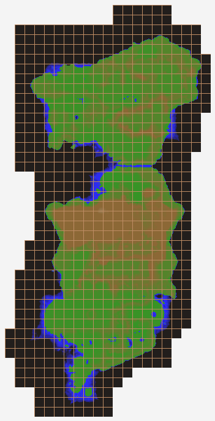

Every map shows as a picture of its heights in the **Maps** panel (right: the Eastern Kingdoms, one cell per tile);
click a tile to fly there.
<br clear="right">

### Objects
| Feature | What it does |
| --- | --- |
| [Objects](docs/objects/objects.md) | Select, move, turn and scale doodads and buildings with a gizmo; furniture follows its building |
| [Catalog](docs/objects/catalog.md) | Browse every model, building, texture and unit with thumbnails; click to place or paint |
| [Dungeons](docs/objects/objects.md#doodad-sets-replacing-dungeon-wmos) | WMO-only maps (most instances) load as their WMO: move, turn or replace it, pick its doodad set; spawns and points stand on its floors |

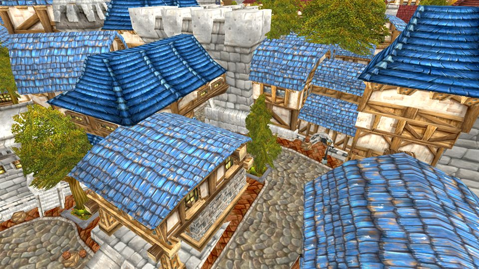

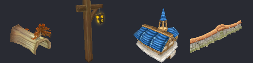

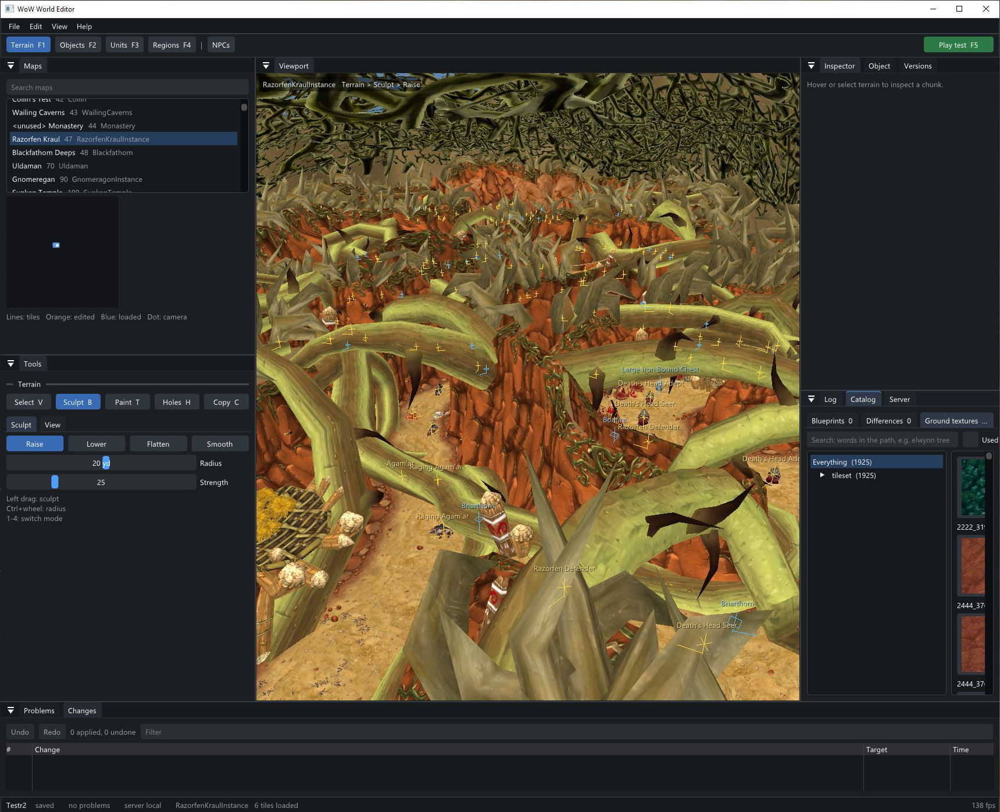

### Units (AzerothCore)
| Feature | What it does |
| --- | --- |
| [Creatures and gameobjects](docs/units/spawns.md) | Place and edit spawns in the world database, with their real models |
| [Paths](docs/units/paths.md) | Draw and edit creature waypoint paths in 3D |
| [NPC viewer](docs/units/npc-viewer.md) | One creature in its own preview (animations, skins, equipment, geosets, textures); edit its template, models and equipment, or copy it as a new NPC; design character appearances (race, face, hair, armour); edit drops, pickpocketing and skinning loot; gossip menus, options, conditions and barks |

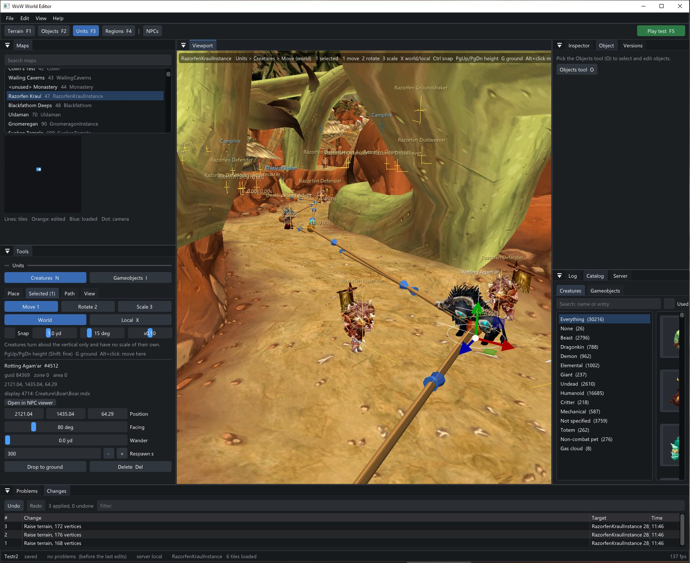

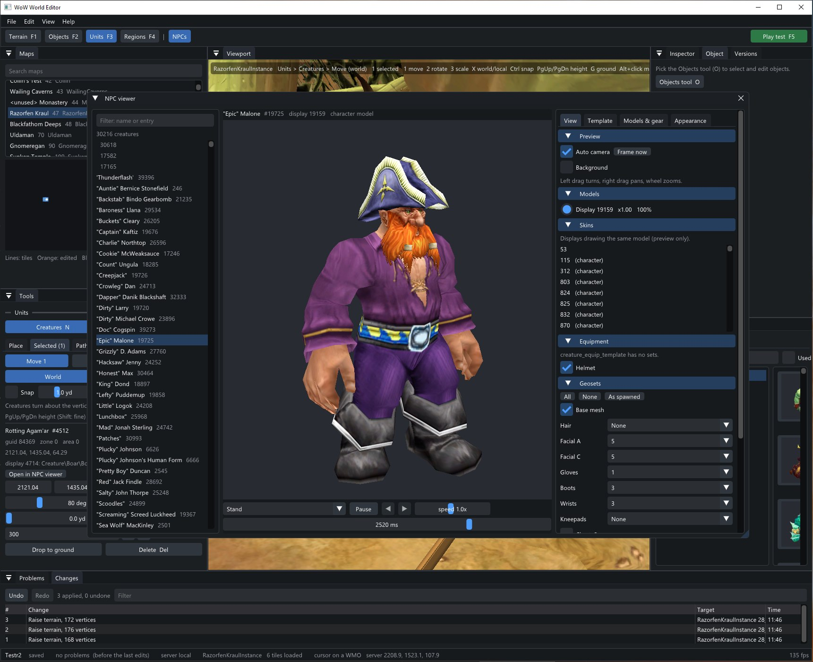

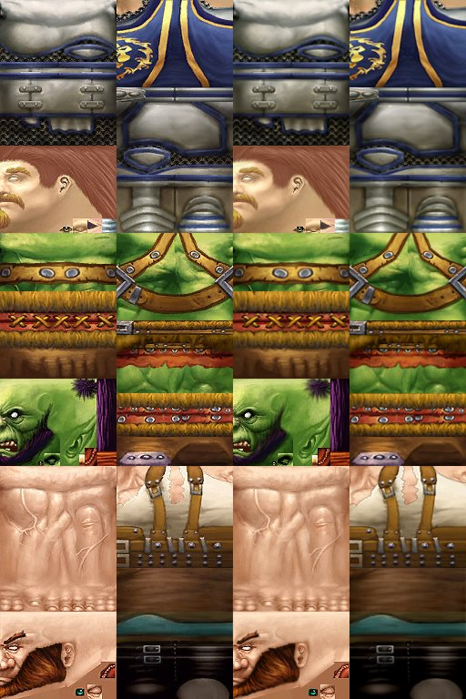

Character NPCs without a baked skin are composited as the client does: skin, face, hair and every armour piece
drawn into place. Right: Blizzard's baked skins (left column) beside the editor's composites of the same NPCs.
<br clear="right">

### Regions
| Feature | What it does |
| --- | --- |
| [Zones](docs/regions/zones.md) | Paint area ids onto the ground, edit AreaTable rows, name buildings' rooms (WMOAreaTable) |
| [World maps](docs/regions/world-maps.md) | Draw a zone's world map and its explored-area overlays from the terrain |
| [Triggers and entrances](docs/regions/triggers.md) | Area triggers (client DBC and server row together), teleports and their arrival points, instance entrances and exits |
| [Points of interest](docs/regions/pois.md) | World map landmarks (AreaPOI.dbc), gossip map flags, `.tele` bookmarks |
| [Flight paths](docs/regions/flight-paths.md) | Taxi nodes, the routes between them and their points; which flight master serves which node |

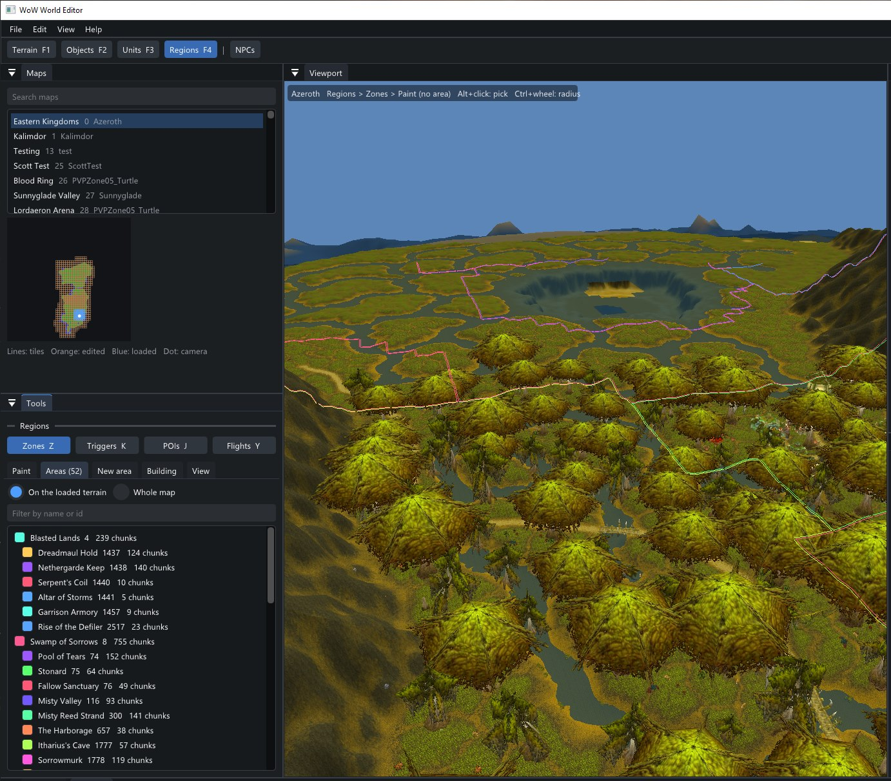

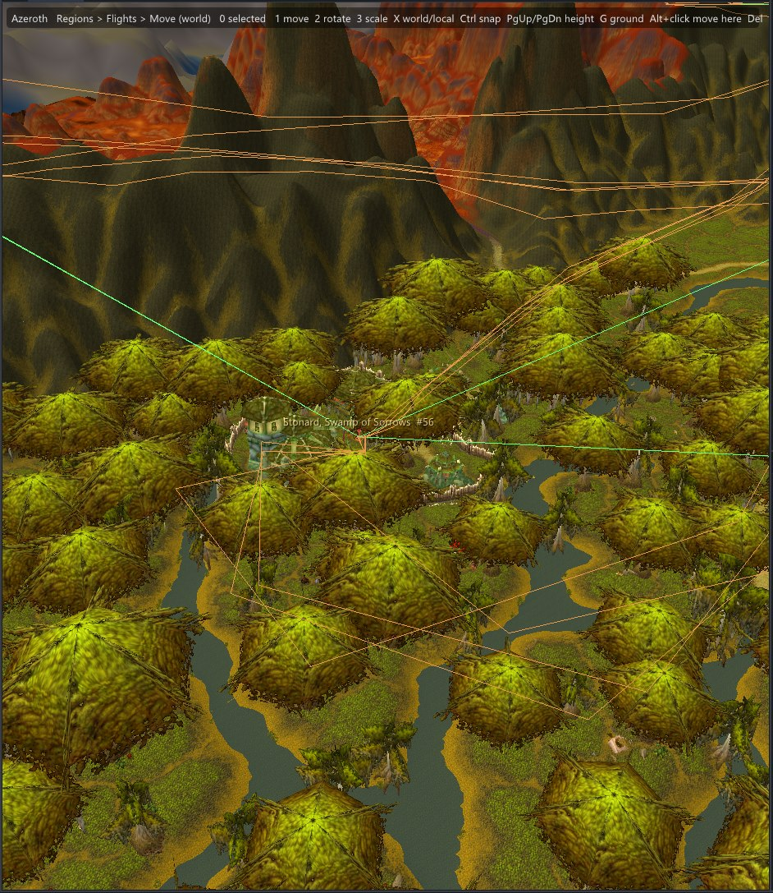

### Atmosphere
| Feature | What it does |
| --- | --- |
| [Lights](docs/atmosphere/lights.md) | Light volumes (Light.dbc) as spheres on the map; sky, fog, sun and water colours by time of day; game lighting in the viewport |
| [Sound and weather](docs/atmosphere/sound.md) | A zone's ambience, music and intro, with previews; its rain, snow and sandstorm chances per season; sound emitters placed in the world |

### Map versions
| Feature | What it does |
| --- | --- |
| [Sources](docs/concepts/sources.md) | Where game files come from: client folders, single MPQs, unpacked folders, mixed folders, in layers |
| [Moving things](docs/concepts/moving-things.md) | One set of handles, keys and live fields for everything that moves: objects, spawns, triggers, points, path points |
| [Ghost layers](docs/versions/ghost-layers.md) | Show other versions of the map over yours; see every version of a tile, patch history included |
| [Compare](docs/versions/compare.md) | Flip a selected area through every other version in place, with what each would cost to paste |
| [Differences](docs/versions/differences.md) | Scan a whole other version, review its edits as cards, approve or reject each; new tiles included |

<!-- shot: compare.png - comparing a selection across versions -->
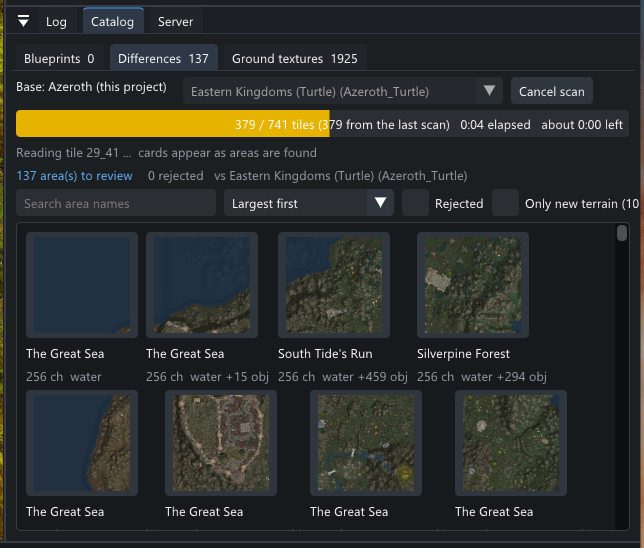

### Output
| Feature | What it does |
| --- | --- |
| [Export and the patch MPQ](docs/output/export-and-patch.md) | Client files, a patch MPQ, play-testing, server SQL and DBCs |
| [Minimaps and far terrain](docs/output/minimaps-and-far-terrain.md) | Minimap pictures of edited tiles; low-detail heights for added tiles |

### Server
| Feature | What it does |
| --- | --- |
| [Server link](docs/server/server-link.md) | Connect to AzerothCore's database and SOAP; run GM commands; check a project for problems |
| [Server data](docs/server/server-data.md) | Rebuild the server's maps, vmaps and mmaps for the maps the project exports, with AzerothCore's own tools; originals kept |

## More documentation

- [Getting started](docs/getting-started.md): build, first project, the window, controls
- [Change model](docs/concepts/change-model.md): how edits are recorded, undone, saved and exported; the project folder
- [Command-line checks](docs/development/checks.md): headless tests and tools (`--selftest`, `--tiles-check`, ...)
- [Code layout](docs/development/code-layout.md): what each source file holds

The scene pictures are drawn by the editor's own renderer from the command line (`tools/readme-images.ps1`); the
pictures of its panels are taken by hand ([docs/images](docs/images/README.md)).
